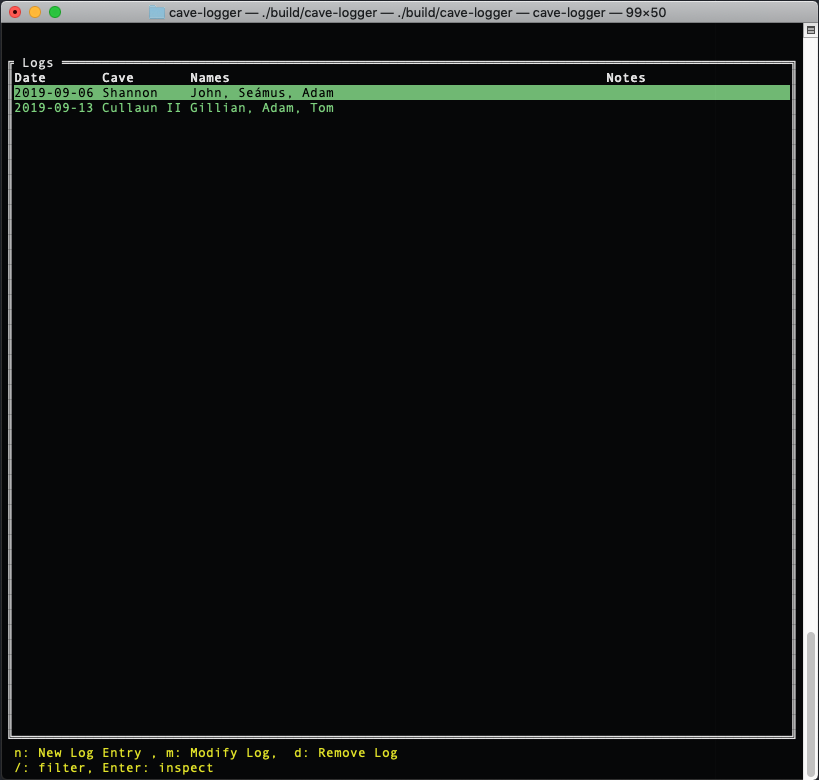

# Cave Logger

## TL;DR
Cave Logger is a basic database interface written in Go, and it allows cavers to track the caves that they have been to, who with, and when. 

## What It Looks Like

## Keybindings

| Key | Function |
|:---:|:--------:|
| <kbd>q</kbd> | quit |
| <kbd>n</kbd> | new |
| <kbd>u</kbd> | update |
| <kbd>d</kbd> | delete |
| <kbd>j</kbd> | down |
| <kbd>k</kbd> | up |
| <kbd>g</kbd> | end |
| <kbd>G</kbd> | home |
| <kbd>Tab</kbd> | see menu |
| <kbd>Enter</kbd> | inspect record |

### Menu
In the Menu the <kbd>Tab</kbd> key will select the highlighted item, and hitting <kbd>Tab</kbd> again will navigate to the Menu.
