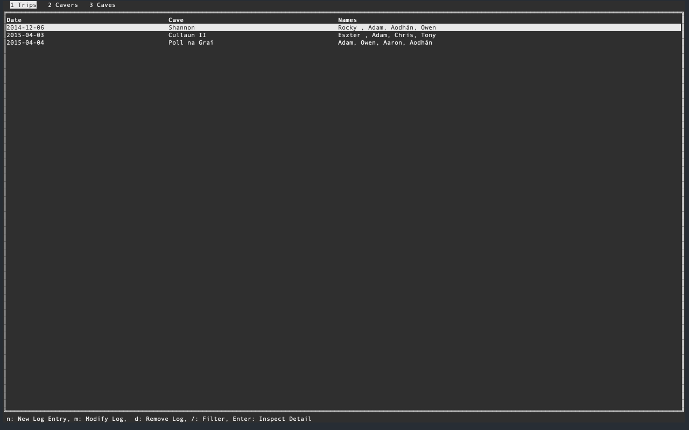

<p align="center"></p>

## Summary
Cave Logger is a basic SQLite database interface written in Go, and it allows cavers to track the caves that they have been to, who with, and when. 

## What It Looks Like
<p align="center"></p>

## Install
You can install by the following set of instructions:

1. Clone or download the repo, and naviagte to the repo directory
2. Compile the binary
    - `make darwin` on a mac
    - `make linux` on linux
3. Assuming the binary has built correctly then you have two courses of action:
    - A. If you have no data to import from another media (or wish to manually insert your data) then simply run `./scripts/make-db.py` and this will create a correctly formatted sqlite database and a config file. This script will also check for a pre-existing config file so as not to overwrite one.
    - B. If you do wish to import existing records then I have a Python script under `./scripts/csv2sqlite.py` that you can modify to your purposes. Note this script will create the database for itself.
4. Finally run `make install`.
5. You will now (provided you have a GOPATH set up) be able to run the application by running `cave-logger` in your shell. This can be overridden with the `PREFIX` variable, i.e. `make PREFIX=/usr/local/bin`.

### Homebrew
Tap repo [here](https://github.com/IdlePhysicist/homebrew-caving)
```
brew tap idlephysicist/caving
brew install idlephysicist/caving/cave-logger
```

### Docker
To run in docker:

1. Clone or download the repo, and naviagte to the repo directory
2. Follow step 3 from above
3. `./docker/run.sh`

